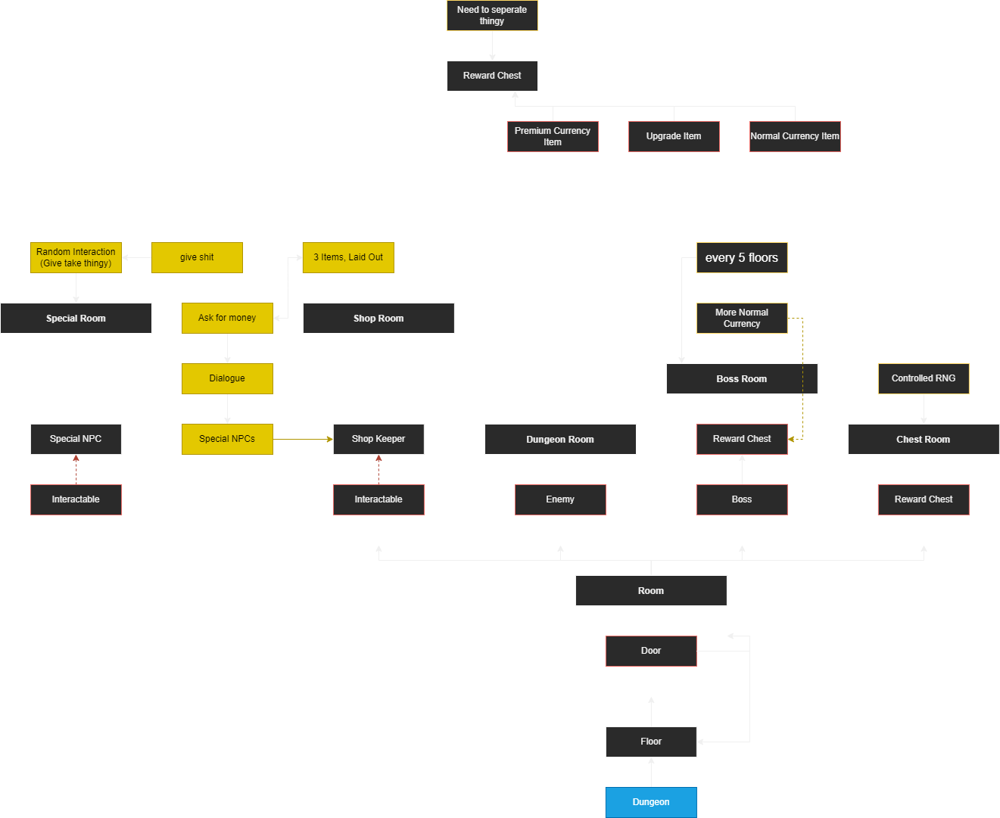

# Dungeon Generator Document

## Flowchart

## Algorithm

### Rules

- Each dungeon should have multiple floors.

- Each floor has multiple rooms.

- Rooms can be of types *Enemy*, *Boss*, *Chest*, *Shop*, or *Special*.

  - ***Enemy*** room types appear randomly in the floor and contains enemies which needs to be defeated in order to unlock the next rooms/floor.

  - ***Boss*** room types appear after a set of floors and contains a boss which needs to be defeated in order to unlock the next floor. Upon defeating the boss, the player is awarded with a reward chest.

  - ***Chest*** room types appear randomly in the floor and contains a reward chest. Collecting the contents of the reward chest would unlock the next rooms/floor.

  - ***Shop*** room types appear randomly in the floor and contains items which the player can purchase through a shop keeper. They are free to leave the room without purchasing anything.

  - ***Special*** room types appear randomly in the floor and contains NPCs which the player can interact with. They are free to leave the room without interacting with these NPCs.

- Each floor should have a *starting* and *exit* room.
  
  - A *Starting* room is where the player spawns.
  - An *Exit* room is where the player proceeds to the next floor/ exits the dungeon.
  - A ***Boss*** room type is considered both a *starting* and *exit* room.

- If the player is unable to complete the dungeon ...

- Upon completion of a dungeon ...
